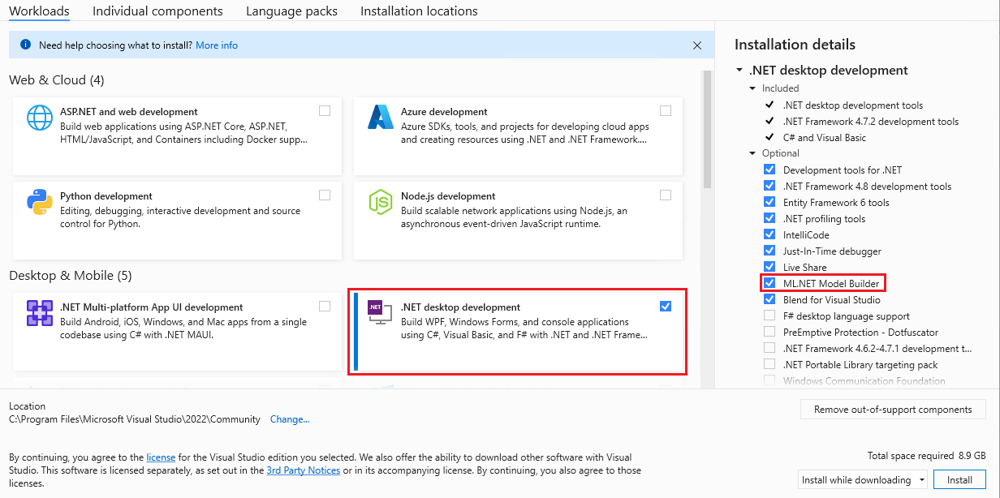

# ML.Net Workshop
in this workshop,we will find out how to use ML.NET to train and use machine learning models in .NET Core with C#.

## Pre-Requisites
-  Visual Studio 2022 (Check for updates)
-  [Download the Latest version of Model Builder](https://marketplace.visualstudio.com/items?itemName=MLNET.ModelBuilder2022&WT.mc_id=dotnet-35129-website)
-  Make sure **ML.NET Model Builder** is installed. it's under the **.NET desktop development** workload.
  
  
 
## More

- [Hands-On Machine Learning with ML.NET](https://www.packtpub.com/product/hands-on-machine-learning-with-mlnet/9781789801781)
- [Hands-On Neural Network Programming with C#](https://www.packtpub.com/product/hands-on-neural-network-programming-with-c/9781789612011)
- [MLOPS](https://ml-ops.org/)
- [Infer.Net](https://github.com/dotnet/infer) - [Introduction](https://dotnet.github.io/infer/InferNet_Intro.pdf)
- [Kaggle](https://www.kaggle.com/)
- [TensorFlow](https://www.tensorflow.org/)
- //TODO: add more...